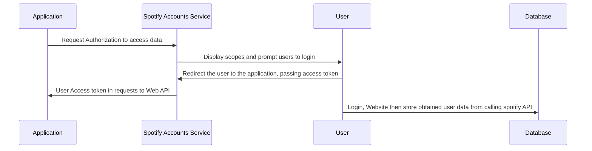
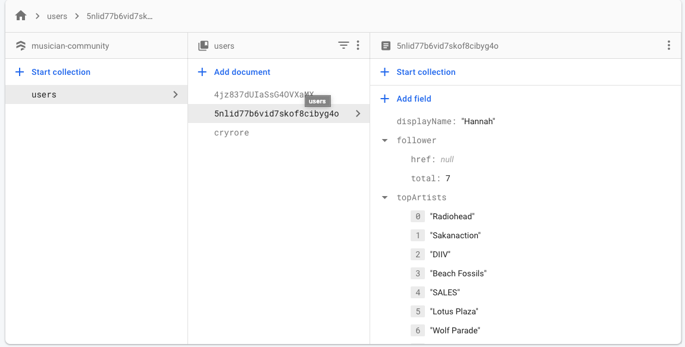

# Database Cachine

## Database Caching Implementation using Firebase Firestore DB and UID-value pair

#### I decided to use Firebase Firestore db as our database. It is a cloud database with clean user interface.

#### First, I initialized db in my index.html using firebase config api information after register the database on firebase site. Next, I obtain user id and their corresponding top artist (array) as UID - Top_Artist pair and store it into the firebase "user" collection. UID as the document value and top_artist as its field value.

#### Sequence Diagram:

