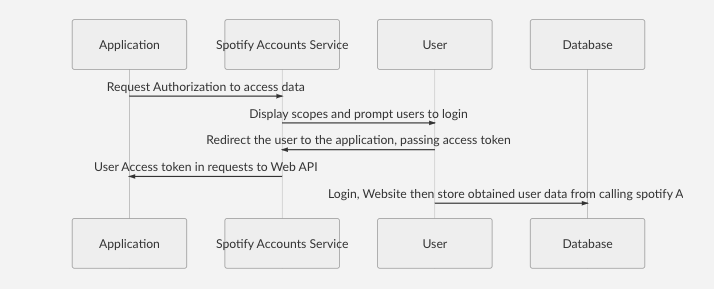
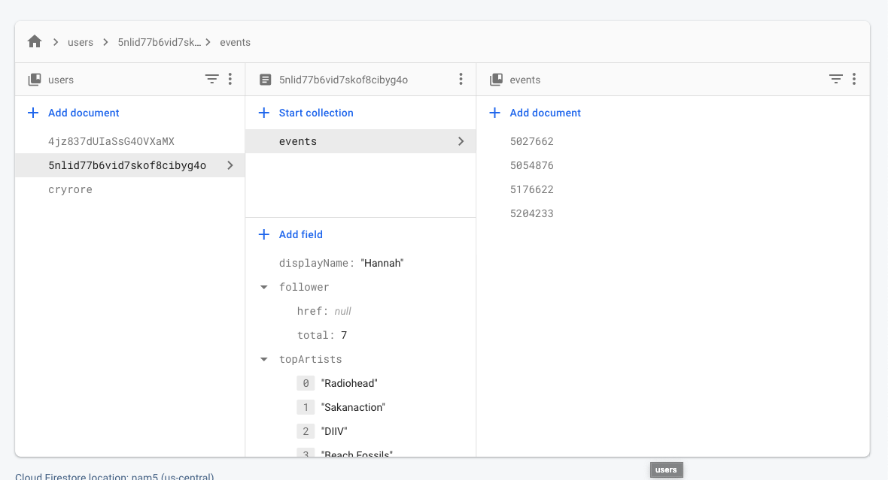
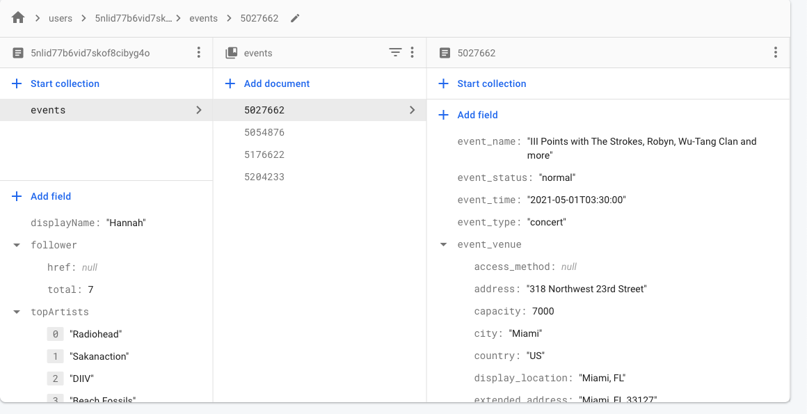

# Database Cachine

## Database Caching Implementation using Firebase Firestore DB and UID-value pair

#### I decided to use Firebase Firestore db as our database. It is a cloud database with clean user interface.

## Database and Spotify API result

First, I initialized db in my index.html using firebase config api information after register the database on firebase site. Next, I obtain user id and their corresponding top artist (array) as UID - Top_Artist pair and store it into the firebase "user" collection. UID as the document value and top_artist as its field value.

## Database and SeatGeek API result

After retrieving the user's top_musician's result and store them into db, I read the db and use the list of top artist to call SeatGeek API in a for loop(after formatted the data into desirable form: all lowercase with dash in between).

After that, I let the db add another collection inside of each user's document everytime the API call is successful and store the events info individually inside the for loop.

## Sequence Diagram:

## Database structure:

